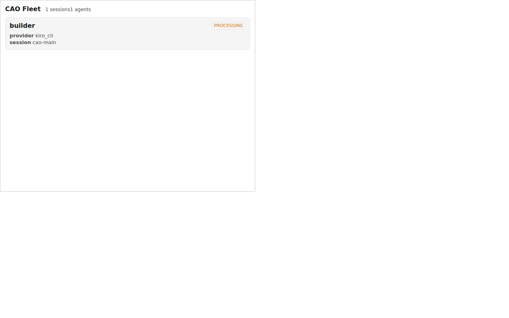

# CLI Agent Orchestrator (CAO)

[English](README.md) | [简体中文](README.zh-CN.md)

[](https://pypi.org/project/cli-agent-orchestrator/)
[](https://pypi.org/project/cli-agent-orchestrator/)
[](https://deepwiki.com/awslabs/cli-agent-orchestrator)

**CLI Agent Orchestrator (CAO)** 是一个开源的多 Agent 编排框架，面向 Claude Code、Kiro CLI、Codex CLI、Antigravity CLI、Hermes Agent、Kimi CLI、GitHub Copilot CLI、OpenCode 和 Cursor CLI 等 AI 编程 CLI。CAO 会把每个 Agent 运行在隔离的 tmux 会话中，并通过 Model Context Protocol (MCP) 以 supervisor-worker 模式协调它们。一个 supervisor Agent 可以并行、串行，或以 swarm 方式把任务分派给多个专长不同的 Agent。

## CAO 是什么？

CAO（读作 "kay-oh"）是一个轻量的本地编排器，位于你和常用 CLI 编程 Agent 之间。你不再只能一次运行一个 Agent，而是可以让 supervisor Agent 启动、发送消息并协调多个 worker Agent。每个 worker 都是真实的 CLI 工具（如 Claude Code、Kiro、Codex 等），运行在自己的 tmux 终端里。

Agent 之间通过 MCP 暴露的原语通信，包括 **handoff**、**assign** 和 **send_message**。你可以通过 CLI、内置 Web UI，或 MCP 管理服务器来管理它们。由于每个 Agent 都是完整的 CLI 进程，CAO 能保留原工具的行为、鉴权方式和高级能力，例如 Claude Code sub-agents、Kiro CLI custom agents 等。这些是普通 API wrapper 难以完整保留的。

## 常见使用场景

- **并行代码审查 / 实现**：supervisor 同时分派 N 个 reviewer 审查 N 个文件，然后汇总结果。
- **跨 provider 工作流**：supervisor 使用一个 CLI（如 Kiro），worker 使用另一个 CLI（如 Claude Code），也可以按 profile 指定 provider。
- **定时 Agent 任务**：通过 [Flows](docs/flows.md) 设置类似 cron 的触发器，例如「每天早上 9 点」运行。
- **CI 中的无头 Agent 执行**：使用 `cao launch --headless --async` 无人值守地运行任务。
- **带 HITL 的多 Agent swarm**：人可以 attach 到任意 tmux 会话，随时介入或调整方向。
- **由 Agent 管理 Agent**：主 Agent 可以在自己的对话循环中使用 [`cao-ops-mcp`](#cao-ops-mcp-server) 创建和监控 CAO 会话。

## 分层多 Agent 系统

CAO 实现的是分层多 Agent 系统：一个 supervisor Agent 把任务委派给专门的 worker Agent，而不是把所有事情都塞进同一个上下文。


### 核心能力

- **分层 supervisor-worker 编排**：supervisor 负责协调与分派，worker 专注自己的任务域。整体上下文得以保留，worker 的上下文也不会被污染。
- **通过 tmux 隔离会话**：每个 Agent 都运行在自己的 tmux 会话中。上下文清晰隔离，保留真实 PTY 访问能力，人也可以随时 `tmux attach` 进去调整。
- **基于 MCP 的编排原语**：`handoff`（同步，等待完成）、`assign`（异步，fire-and-forget）和 `send_message`（Agent 间 inbox 投递）。Hermes worker 还会使用 `answer_user_prompt` 处理结构化审批和澄清提示；其他 provider 在实现等价 prompt 状态前，可能回退为普通文本投递。详见 [Multi-Agent Orchestration](#multi-agent-orchestration)。
- **跨 provider 混用**：同一个会话里可以让 worker 运行在不同 CLI 上。可以通过 Agent frontmatter 把某个 profile 固定到指定 provider。详见 [Cross-Provider Orchestration](#cross-provider-orchestration)。
- **定时 flows**：用类似 cron 的方式调度无人值守的 Agent 运行。详见 [docs/flows.md](docs/flows.md)。
- **Web UI、CLI 和 MCP 三种控制面**：可以从浏览器、`cao session` 命令，或 `cao-ops-mcp` server 管理会话。详见 [docs/control-planes.md](docs/control-planes.md)。
- **按 Agent 限制工具权限**：通过 profile 中的 `role` 和 `allowedTools` 控制权限，并在可用时转换为各 provider 的原生限制。详见 [docs/tool-restrictions.md](docs/tool-restrictions.md)。
- **持久化 Agent 记忆**：Agent 可以通过 `memory_store` 和 `memory_recall` MCP 工具跨会话保存和召回知识。CAO 会在会话启动时自动注入相关记忆作为上下文。详见 [docs/memory.md](docs/memory.md)。
- **直接介入 worker**：不同于传统的「sub-agent」功能，你可以 attach 到正在运行的 worker，并在任务中途介入。
- **保留完整 CLI 能力**：Agent 保留原 CLI 的能力，包括 Claude Code [sub-agents](https://docs.claude.com/en/docs/claude-code/sub-agents)、Kiro CLI custom agents、provider 原生鉴权等。
- **用于 outbound events 的插件系统**：可以把 Agent 间消息转发到 Discord、Slack、Telegram 或任意 webhook 目标。详见 [Plugins](#plugins)。

项目结构和架构细节请参考 [CODEBASE.md](CODEBASE.md)。

## 安装

### 环境要求

- **curl** 和 **git**：用于下载安装脚本和克隆仓库。
- **Python 3.10 或更高版本**：详见 [pyproject.toml](pyproject.toml)。
- **tmux 3.3+**：用于 Agent 会话隔离。
- **[uv](https://docs.astral.sh/uv/)**：快速的 Python 包安装器和虚拟环境管理器。

### 1. 安装 Python 3.10+

```bash
# macOS (Homebrew)
brew install python@3.12

# Ubuntu/Debian
sudo apt update && sudo apt install python3.12 python3.12-venv

# Amazon Linux 2023 / Fedora
sudo dnf install python3.12
```

验证：

```bash
python3 --version   # 3.10 or higher
```

> 建议使用 [uv](https://docs.astral.sh/uv/)，而不是 Anaconda 这类系统级 Python 安装。`uv` 会按项目处理虚拟环境和 Python 版本解析。

### 2. 安装 tmux (3.3+)

```bash
bash <(curl -s https://raw.githubusercontent.com/awslabs/cli-agent-orchestrator/refs/heads/main/tmux-install.sh)
```

### 3. 安装 uv

```bash
curl -LsSf https://astral.sh/uv/install.sh | sh
source $HOME/.local/bin/env   # 将 uv 加入 PATH，或重启 shell
```

### 4. 安装 CLI Agent Orchestrator

```bash
uv tool install git+https://github.com/awslabs/cli-agent-orchestrator.git@main --upgrade
```

该命令会拉取最新的 `main` commit，并把预构建的 Web UI 一起打包进 wheel。因此，**使用 CAO 不需要安装 Node.js，也不需要运行 `npm install`**。只有在你要以前端开发模式（hot-reload）运行或自行重新构建 bundle 时，才需要 Node.js。详见 [docs/web-ui.md](docs/web-ui.md)。

#### 从 PyPI 安装（可选）

PyPI 只发布带 tag 的 release，因此在两个 release 之间会落后于 `main`。如果你想使用最新修复，优先使用上面的 `git+` 安装方式。

```bash
uv tool install cli-agent-orchestrator --upgrade

# 固定到某个 release
uv tool install cli-agent-orchestrator==2.1.0
```

本地开发（`git clone` + `uv sync`）以及测试 / 质量检查流程，请参考 [DEVELOPMENT.md](DEVELOPMENT.md)。

## Devcontainer Feature

CAO 提供官方 devcontainer feature，支持以容器原生方式安装。

- 使用方式和选项：[docs/devcontainer-feature.md](docs/devcontainer-feature.md)
- 本地验证命令：[docs/devcontainer-feature.md#validation](docs/devcontainer-feature.md#validation)
- 发布计划：[docs/devcontainer-feature.md#release-plan](docs/devcontainer-feature.md#release-plan)

## 前置条件：CLI Agent 工具

CAO 驱动的是已有 CLI Agent 工具，它并不会替代这些工具。使用 CAO 前，请至少安装下面一种工具。你也可以安装多个，并在同一次编排中混用。

| Provider | 文档 | 鉴权 |
|----------|------|------|
| **Kiro CLI**（默认） | [Provider docs](docs/kiro-cli.md) · [Installation](https://kiro.dev/docs/kiro-cli) | AWS credentials |
| **Claude Code** | [Provider docs](docs/claude-code.md) · [Installation](https://docs.anthropic.com/en/docs/claude-code/getting-started) | Anthropic API key |
| **Codex CLI** | [Provider docs](docs/codex-cli.md) · [Installation](https://github.com/openai/codex) | OpenAI API key |
| **Hermes Agent** | [Provider docs](docs/hermes.md) | Hermes auth；可选 `hermesProfile` wrapper；在选中的 Hermes profile 中配置 `cao-mcp-server` 以启用编排工具 |
| **Kimi CLI** | [Provider docs](docs/kimi-cli.md) · [Installation](https://platform.moonshot.cn/docs/kimi-cli) | Moonshot API key |
| **GitHub Copilot CLI** | [Provider docs](docs/copilot-cli.md) · [Installation](https://github.com/features/copilot/cli) | GitHub auth |
| **OpenCode CLI**（实验性；多 Agent callback 暂时使用 inbox polling fallback，见 [#203](https://github.com/awslabs/cli-agent-orchestrator/issues/203)） | [Provider docs](docs/opencode-cli.md) · [Installation](https://opencode.ai) | Per-model API key |
| **Cursor CLI** | [Provider docs](docs/cursor-cli.md) · [Installation](https://cursor.com/cli) | Cursor subscription / API key |
| **Antigravity CLI** | [Provider docs](docs/antigravity-cli.md) · [Installation](https://antigravity.google) | Google account（与 Antigravity IDE 登录共用） |

## 快速开始

### 1. 安装 Agent profiles

```bash
cao install code_supervisor      # 负责委派 worker 的 supervisor
cao install developer            # 可选 worker
cao install reviewer             # 可选 worker
```

也可以从本地文件或 URL 安装 Agent：

```bash
cao install ./my-custom-agent.md
cao install https://example.com/agents/custom-agent.md
```

如何创建自定义 Agent profile，请参考 [docs/agent-profile.md](docs/agent-profile.md)。

#### Profile 管理（`cao profile`）

```bash
cao profile list                                    # 列出所有已安装 profile
cao profile show <name|file>                        # 查看 frontmatter 详情
cao profile validate <name|file>                    # Schema 和弃用项检查
cao profile templates                               # 列出脚手架模板
cao profile create -t aws/stepfunction -c config.json  # 基于模板生成
cao profile remove <name>                           # 从本地 store 删除
```

### 2. 启动 server

```bash
cao-server
```

### 3. 启动 supervisor

在另一个终端中运行：

```bash
cao launch --agents code_supervisor

# 或指定 provider
cao launch --agents code_supervisor --provider claude_code
# 可选值：kiro_cli | claude_code | codex | antigravity_cli | hermes | kimi_cli | copilot_cli | opencode_cli | cursor_cli

# 不限制访问、跳过确认（危险）
cao launch --agents code_supervisor --yolo
```

supervisor 会使用这些编排模式协调并委派任务给 worker Agent。

### 4. 关闭

```bash
cao shutdown --all                      # 关闭所有 CAO 会话
cao shutdown --session cao-my-session   # 关闭指定会话
```

### 会话运行在 tmux 中

所有 Agent 会话都运行在 tmux 中。你可以通过 `tmux attach -t <session-name>` 实时观察 Agent。完整 tmux 快捷键列表和交互式窗口选择器请参考 [docs/tmux.md](docs/tmux.md)。

CAO 也实验性支持 [herdr](https://herdr.dev/) 作为替代后端。herdr 能感知 Agent 状态，因此可以用实时状态事件替代 tmux 输出轮询。配置方式见 [docs/herdr.md](docs/herdr.md)。

## Web UI

CAO 自带 Web dashboard，可在浏览器中管理 Agent、终端和 flows。预构建 UI 已经打包在 wheel 中，不需要额外安装。启动 server 即可：

```bash
cao-server
```

然后打开 http://localhost:9889。


hot-reload 开发模式、通过 SSH 远程访问，以及从源码重新构建前端（只有这些场景需要 Node.js），请参考 [docs/web-ui.md](docs/web-ui.md)。前端架构见 [web/README.md](web/README.md)。

## MCP Apps：host-rendered fleet UI

除浏览器 dashboard 外，CAO 也可以通过 [MCP Apps](https://modelcontextprotocol.io/extensions/apps/overview) 扩展（SEP-1865），把 fleet UI 渲染到支持 MCP App 的 host 内部，例如 Claude / Claude Desktop、ChatGPT、VS Code GitHub Copilot、Microsoft 365 Copilot、Goose、Postman、MCPJam、Archestra.AI。客户端支持情况见 [client matrix](https://modelcontextprotocol.io/extensions/client-matrix)。这样你可以在不离开聊天 host 的情况下观察并控制 Agent。

该能力包含三个单文件视图（`ui://cao/dashboard`、`ui://cao/agent`、`ui://cao/event-stream`）和一个无需构建的 topology widget，后端由进程内 event ring buffer 和单一审计过的 `submit_command` mutation 路径支撑。



*fleet dashboard 由构建后的 `ui://cao/dashboard` bundle 渲染。完整动态演示（dashboard → agent detail → live event stream）：[`docs/media/mcp-apps-demo.webm`](docs/media/mcp-apps-demo.webm)。可通过 `cd cao_mcp_apps && npm run build:all && node scripts/record-demo.mjs` 重新生成。*

该能力**默认关闭，并且不改变既有行为**。它以内置 `mcp_apps` plugin 的形式打包，只有显式启用时才会注册：

```bash
export CAO_MCP_APPS_ENABLED=true
cao-server        # REST + SSE /events on :9889
cao-mcp-server    # 为你的 host 注册 MCP App tools/resources
```

这一部分新增了 `src/cli_agent_orchestrator/ext_apps/`（resources + topology widget）、`cao_mcp_apps/`（JIT-free React views）和 `src/cli_agent_orchestrator/plugins/builtin/mcp_apps.py`（plugin）。相关文档见 [docs/mcp-apps.md](docs/mcp-apps.md)，示例见 [examples/mcp-apps/](examples/mcp-apps/)，operator playbook 见 [skills/cao-mcp-apps](skills/cao-mcp-apps/SKILL.md)。如果配置了 IdP，可选且默认关闭的 OAuth 2.1 scopes（`cao:read` / `cao:write` / `cao:admin`）会保护 mutation 操作。

单文件视图的源码位于 `cao_mcp_apps/`。开发流程（构建、测试、CI coverage/JIT/bundle-size gates）请参考 [cao_mcp_apps/README.md](cao_mcp_apps/README.md)。Node.js 只在重新构建它们时需要，运行 CAO 时不需要。

## Multi-Agent Orchestration

CAO Agent 通过本地 HTTP server（默认 `localhost:9889`）协调。CLI Agent 通过 MCP tools 访问该 server，从而路由消息、跟踪状态并驱动编排。

每个 Agent 终端都会被分配一个唯一的 `CAO_TERMINAL_ID` 环境变量。server 使用这个 ID 路由消息、跟踪终端状态（IDLE / PROCESSING / COMPLETED / ERROR），并协调操作。当 Agent 调用 MCP tool 时，server 会根据调用方的 `CAO_TERMINAL_ID` 识别它。

### 编排模式

> **Note:** 当通过 `CAO_ENABLE_WORKING_DIRECTORY=true` 启用时，所有编排模式都支持可选的 `working_directory` 参数。详见 [docs/working-directory.md](docs/working-directory.md)。

**1. Handoff**：把控制权移交给另一个 Agent，并等待其完成。

- 创建一个使用指定 Agent profile 的新终端。
- 发送任务消息，并等待 Agent 完成。
- 把 Agent 输出返回给调用方，并退出该 Agent。
- **成功后自动删除 worker 终端**：scrollback 和 metadata 会在删除前保存到 `~/.cao/logs/terminal/`。只要会话仍然存在，你就可以用 `cao terminal restore <terminal_id>` 恢复终端以便调试。完整生命周期、snapshot schema 和 restore 语义见 [docs/terminal-lifecycle.md](docs/terminal-lifecycle.md)。
- 适合需要**同步**执行并拿到结果的场景。

示例：串行代码审查工作流。


**2. Assign**：创建一个独立工作的 Agent（异步）。

- 创建新终端，发送带 callback instructions 的任务，然后立即返回。
- supervisor 的 terminal ID 会自动附加到任务消息中（可用 `CAO_ENABLE_SENDER_ID_INJECTION=false` 禁用），并记录在 worker 终端上，使 callback 以结构化方式路由。
- 分派出去的 Agent 完成后，通过 `send_message` 回传结果。如果省略 `receiver_id`，回复会路由到分派它的终端；如果 supervisor 正忙，消息会排队。
- 适合**异步**执行或 fire-and-forget 操作。

示例：supervisor 把并行数据分析任务分派给多个 analyst，同时用 handoff 生成报告模板，然后合并结果。详见 [examples/assign](examples/assign)。


**3. Send Message**：与已有 Agent 通信。

- 把消息发送到指定终端的 inbox；终端空闲时投递。
- 支持持续协作和多轮对话。
- 常用于 **swarm** 操作。
- 对会在处理期间缓冲输入的 provider，支持 [eager delivery](docs/inbox-delivery.md)，用于消除轮次之间的延迟。

示例：多角色功能开发。


### Cross-Provider Orchestration

默认情况下，worker 会继承创建它们的终端所使用的 provider。如果要把某个 profile 固定到指定 provider，请在 frontmatter 中加入 `provider`：

```markdown
---
name: developer
provider: claude_code
---
```

有效值包括：`kiro_cli`、`claude_code`、`codex`、`antigravity_cli`、`hermes`、`kimi_cli`、`copilot_cli`、`opencode_cli`、`cursor_cli`。初始会话始终以 `cao launch --provider` 参数为准。详见 [`examples/cross-provider/`](examples/cross-provider/)。

### Tool Restrictions

CAO 通过 profile 中的 `role` 和 `allowedTools` 控制每个 Agent 可以做什么。CAO 会在可用时把这些限制转换为各 provider 的原生 enforcement。完整参考见 [docs/tool-restrictions.md](docs/tool-restrictions.md)。

### Custom Orchestration

`cao-server` 暴露 REST APIs，用于会话管理、终端控制和消息传递。内置 CLI 命令和 MCP tools 只是这些 API 的封装。你可以组合三种编排模式构建自定义工作流，也可以基于底层 API 构建新的模式。详见 [docs/api.md](docs/api.md)。

## 扩展与集成

CAO 提供三种从外部驱动它的编程界面，以及两个扩展点（skills 和 plugins）。如何选择合适界面，请参考 [docs/control-planes.md](docs/control-planes.md)。

### Session Management CLI

`cao session` 命令用于以程序化方式管理会话，适合脚本、CI pipeline，或任何可以运行 shell 命令的调用方。

| 命令 | 说明 |
|------|------|
| `cao session list` | 列出活跃会话 |
| `cao session status <name>` | 显示 conductor 状态和最新输出 |
| `cao session status <name> --workers` | 同时包含 worker 终端状态 |
| `cao session send <name> "msg"` | 发送消息并等待完成 |
| `cao session send <name> "msg" --async` | Fire-and-forget |
| `cao session send <name> "msg" --timeout N` | 最多等待 N 秒 |
| `cao launch --agents <profile>` | 启动新的 supervisor 会话 |
| `cao shutdown --session <name>` | 关闭指定会话 |
| `cao shutdown --all` | 关闭所有 CAO 会话 |
| `cao terminal restore <terminal_id>` | 把已删除终端的 scrollback 恢复到新窗口中，便于调试 |

无头启动（发送初始任务但不 attach）：

```bash
cao launch --agents supervisor --headless --yolo \
  --session-name my-task --working-directory '/path/to/project' "Your task here"
```

加上 `--async` 可以立即返回，不等待任务完成。

> Session name 会自动加上 `cao-` 前缀。后续命令中请使用带前缀的形式，例如 `cao-my-task`。

命令参考和面向 Agent 的 skill，请查看 [Session Management skill](skills/cao-session-management/SKILL.md)。

由于 `cao session` 本质上是 shell 命令，任何支持调用 shell skill 的 AI assistant 理论上都能用这种方式驱动 CAO，例如 Claude Code、Kiro CLI、[OpenClaw](https://github.com/openclaw/openclaw) 或 [Hermes Agent](https://github.com/NousResearch/hermes-agent)。把 CAO session management 集成到外部工具的方式见 [docs/external-tool-integration.md](docs/external-tool-integration.md)。

### CAO Ops MCP Server

`cao-ops-mcp` 以结构化 MCP tools 的形式，为主 Agent（Claude Code、Claude Desktop 等）暴露同样的管理操作。它是 `cao session` 的 MCP 版本：调用方支持 MCP 时用 `cao-ops-mcp`，否则用 `cao session`。

| Server | 使用者 | 用途 |
|--------|--------|------|
| `cao-mcp-server` | CAO 会话**内部**的 Agent | Agent 间编排（`handoff`、`assign`、`send_message`） |
| `cao-ops-mcp` | CAO 会话**外部**的主 Agent | 元管理（安装 profile、启动 / 监控会话） |

**设置**：添加到主 Agent 的 MCP 配置中。需要先运行 `cao-server`，监听 `localhost:9889`。

Claude Code 可添加到 `.mcp.json`：

```json
{
  "mcpServers": {
    "cao-ops-mcp": {
      "command": "uvx",
      "args": ["--from", "git+https://github.com/awslabs/cli-agent-orchestrator.git@main", "cao-ops-mcp-server"]
    }
  }
}
```

其他 Agent 使用等价的 stdio MCP 命令：

```text
uvx --from git+https://github.com/awslabs/cli-agent-orchestrator.git@main cao-ops-mcp-server
```

**可用工具**：`list_profiles`、`get_profile_details`、`install_profile`、`launch_session`、`send_session_message`、`list_sessions`、`get_session_info`、`shutdown_session`。

典型流程：`list_profiles` → `install_profile` → `launch_session` → `send_session_message` → `get_session_info` → `shutdown_session`。

### Flows：定时 Agent 会话

使用 cron expressions 定时运行 Agent 会话：

```bash
cao schedule add daily-standup.md
cao schedule list
cao schedule run daily-standup   # 手动运行，忽略 schedule
```

Flows 支持静态 prompts，也支持通过 gating script 做条件执行。定时执行要求 `cao-server` 正在运行。

完整指南，包括 flow 文件格式、条件执行模式和所有 `cao schedule` 命令，请参考 [docs/flows.md](docs/flows.md)。

### Skills

Skills 是可移植的结构化指南，遵循通用 [SKILL.md](https://github.com/anthropics/skills) 格式，用来为 Agent 编码领域知识。它们可以跨编程 assistant 使用，包括 Claude Code、Kiro CLI、Codex CLI、Kimi CLI、GitHub Copilot、Cursor、OpenCode、LobeHub，也可以用于 [Strands Agents SDK](https://strandsagents.com/docs/user-guide/concepts/plugins/skills/) 和 [Microsoft Agent Framework](https://devblogs.microsoft.com/agent-framework/give-your-agents-domain-expertise-with-agent-skills-in-microsoft-agent-framework/) 等框架。

CAO 自带内置 skills，也会管理所有 Agent 会话共享的 "managed skills"。内置项（`cao-supervisor-protocols`、`cao-worker-protocols`）会在 server 启动时自动 seed。你也可以添加自己的 skill：

```bash
cao skills list
cao skills add ./my-coding-standards
cao skills add ./my-coding-standards --force   # 覆盖
cao skills remove my-coding-standards
```

Skills 会自动投递给 provider（Kiro CLI 使用原生 `skill://` resources；Claude Code / Codex / Kimi 使用运行时 prompt injection；Copilot 则烘焙进 `.agent.md`）。

完整参考，包括 authoring、loading 和 delivery mechanics，请查看 [docs/skills.md](docs/skills.md)。与 OpenClaw 或其他外部工具集成，请参考 [docs/external-tool-integration.md](docs/external-tool-integration.md)。

### Plugins

Plugins 是 observer-only 的 Python 扩展，会在 `cao-server` 内部响应 server-side events，包括生命周期变化和消息投递。它们是 CAO 的 **outbound** 扩展面：上面介绍的界面用于驱动 CAO，plugins 则把事件流向外部。常见用途包括把 Agent 间消息转发到 Discord / Slack / Telegram、审计日志和指标导出。

- **安装、事件、故障排查**：[docs/plugins.md](docs/plugins.md)
- **可直接运行的示例**：[examples/plugins/cao-discord/](examples/plugins/cao-discord/)
- **编写自己的 plugin**：[cao-plugin skill](skills/cao-plugin/SKILL.md)
- **plugins 与 inbound surfaces 的关系**：[docs/control-planes.md](docs/control-planes.md)

## 安全

`cao-server` 设计为**仅在 localhost 使用**。WebSocket terminal endpoint（`/terminals/{id}/ws`）提供完整 PTY 访问能力，并拒绝非 loopback 连接。不要在没有鉴权的情况下把 server 暴露给不可信网络。

**DNS rebinding 防护**：server 会校验 HTTP `Host` headers。如果 host 不是 `localhost` 或 `127.0.0.1`，请求会以 `400 Bad Request` 拒绝。这可以防护 [DNS rebinding attacks](https://owasp.org/www-community/attacks/DNS_Rebinding)。

如果你确实需要把 server 暴露到网络中（开发场景下不推荐），Host header 校验也会拒绝这些请求，除非该 hostname 已加入 allowed list。

漏洞报告和最佳实践请参考 [SECURITY.md](SECURITY.md)。

## 贡献

贡献指南请参考 [CONTRIBUTING.md](CONTRIBUTING.md)。

## 发布

CAO 通过使用 OIDC 鉴权的 GitHub Actions pipeline 发布到 [PyPI](https://pypi.org/project/cli-agent-orchestrator/)（TestPyPI → smoke test → maintainer-approved prod）。详见 [docs/RELEASING.md](docs/RELEASING.md)。

## 许可证

Apache-2.0。
