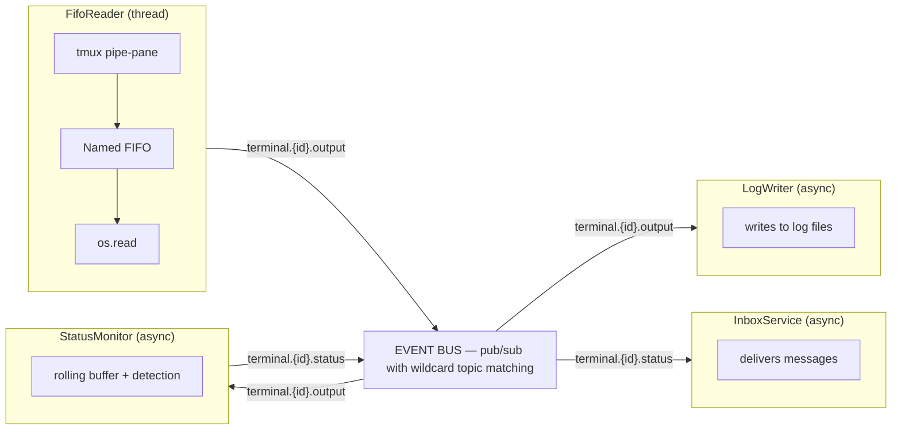

# Event-Driven Architecture

## Overview

CAO uses an event-driven architecture for terminal output processing, status detection, and inbox message delivery. Terminal output streams through a pipeline of components connected by an in-process pub/sub event bus.

## Architecture

```
┌───────────────────┐  publish    ┌──────────────────────────┐  subscribe  ┌─────────────┐
│ FifoReader        │────────────▶│        EVENT BUS         │────────────▶│ LogWriter   │
│ (thread)          │  terminal.  │                          │  terminal.  │ (async)     │
│                   │  {id}.      │  pub/sub with wildcard   │  {id}.      │             │
│ tmux pipe-pane    │  output     │  topic matching          │  output     │ writes to   │
│  ▼ Named FIFO     │             │                          │             │ log files   │
│  ▼ os.read()      │             │                          │             └─────────────┘
└───────────────────┘             │                          │
                                  │                          │  subscribe  ┌───────────────┐
                                  │                          │────────────▶│ StatusMonitor │
                                  │                          │  terminal.  │ (async)       │
                                  │                          │  {id}.      │               │
                                  │                          │  output     │ rolling buffer│
                                  │                          │             │ + detection   │
                                  │                          │◀────────────│               │
                                  │                          │  publish    └───────────────┘
                                  │                          │  terminal.
                                  │                          │  {id}.
                                  │                          │  status
                                  │                          │
                                  │                          │  subscribe  ┌─────────────┐
                                  │                          │────────────▶│InboxService │
                                  │                          │  terminal.  │ (async)     │
                                  │                          │  {id}.      │             │
                                  │                          │  status     │ delivers    │
                                  └──────────────────────────┘             │ messages    │
                                                                           └─────────────┘
```



All inter-service communication flows through the event bus. No service calls another service directly for event processing — the bus is the sole brokering mechanism.

## Event Bus (`services/event_bus.py`)

The event bus is the **central brokering mechanism** that connects all publishers and consumers. It implements an in-process pub/sub router with wildcard topic matching, thread-safe publishing, and async consumption via `asyncio.Queue`.

Every component in the pipeline communicates exclusively through the event bus — publishers never call consumers directly. This decouples components, allows new consumers to be added without modifying publishers, and ensures a clear data flow through the system.

**Topics:**

| Topic | Publisher | Consumers |
|-------|----------|-----------|
| `terminal.{id}.output` | FifoReader | StatusMonitor, LogWriter |
| `terminal.{id}.status` | StatusMonitor | InboxService |

**Subscription patterns:**

- Exact: `terminal.abc12345.output`
- Wildcard: `terminal.*.output` (matches any terminal ID)

**Thread safety:** Publishers call `bus.publish()` from any thread. The event bus uses `loop.call_soon_threadsafe()` to dispatch events into the asyncio event loop registered at startup via `bus.set_loop()`.

## Component Roles

Each service has a clearly defined role as a **publisher**, **consumer**, or **both**:

| Component | Role | Subscribes To | Publishes To |
|-----------|------|---------------|--------------|
| **FifoReader** | Publisher only | — (reads from OS FIFO) | `terminal.{id}.output` |
| **StatusMonitor** | Publisher + Consumer | `terminal.*.output` | `terminal.{id}.status` |
| **LogWriter** | Consumer only | `terminal.*.output` | — |
| **InboxService** | Consumer only | `terminal.*.status` | — (delivers via `send_input`) |

- **Pure publishers** (FifoReader) are the data sources that inject events into the bus.
- **Pure consumers** (LogWriter, InboxService) react to events and perform side effects (writing logs, delivering messages).
- **Publisher + Consumer** (StatusMonitor) transforms events: it consumes raw output, derives status, and publishes status change events for downstream consumers.

> **Warning: Threading and event loop discipline.** Publisher and consumer implementations must take great care when managing threading. The FifoReader runs in a dedicated OS thread (blocking `os.read` on the FIFO) and publishes into the asyncio loop via `call_soon_threadsafe`. All consumers (`StatusMonitor`, `LogWriter`, `InboxService`) run as asyncio tasks on the main event loop. Consumer `run()` methods must **always yield back to the event loop** (via `await queue.get()`) and avoid long-running synchronous operations that would block other consumers from processing events. If a consumer needs to perform blocking I/O, it should offload to a thread pool via `asyncio.to_thread()`.

## Components

### FIFO Reader (`services/fifo_reader.py`) — Publisher

Creates a named pipe (FIFO) per terminal and starts a daemon reader thread. tmux's `pipe-pane` writes terminal output to the FIFO; the reader reads 4KB chunks and publishes `terminal.{id}.output` events.

Chunks are **coalesced** before publishing (`_COALESCE_WINDOW = 50ms`). TUI providers like kiro-cli animate a spinner at ~10 fps and each frame is a separate FIFO write — publishing one event per raw read would overflow the shared 1024-slot async queue and drop worker state transitions along with the animation noise. Batching every 50ms of chunks into one event reduces publish rate ~20x during bursts while staying well under StatusMonitor's 200ms quiescence debounce, so status detection is unaffected. A hard cap of 64KB per batch prevents unbounded growth during heavy sustained bursts (e.g. streaming LLM output). Pending bytes flush automatically when the writer goes idle (select returns nothing), so a paused writer never strands data.

### Status Monitor (`services/status_monitor.py`) — Publisher + Consumer

Subscribes to `terminal.*.output`. Accumulates output into a rolling buffer (8KB) per terminal, detects status via the registered provider (returning `UNKNOWN` until a provider is registered for the terminal), and publishes `terminal.{id}.status` on change. Also the source of truth for current terminal status.

Two buffer-reset primitives with different semantics:

- **`reset_buffer(terminal_id)`** — clears the rolling byte buffer AND wipes `_last_status` and the `_allow_processing_revert` arm. Used by providers that relaunch a different CLI mode on the same `terminal_id` (e.g. Kiro's TUI → `--legacy-ui` fallback), where past status is deliberately forgotten.
- **`clear_rolling_buffer(terminal_id)`** — clears ONLY the byte buffer, preserving `_last_status` and the arm. Used by `terminal_service.send_input` to drop stale pre-task idle placeholders (kiro-cli 2.11's TUI keeps `"ask a question or describe a task"` in the raw buffer at all times) without wiping the sticky-latch arm that `notify_input_sent` just set. Without this distinction, the buffer clear would silently consume the arm and the subsequent IDLE→PROCESSING transition would be latch-blocked.

### Log Writer (`services/log_writer.py`) — Consumer

Subscribes to `terminal.*.output`. Appends chunks to per-terminal log files (`~/.cao/logs/terminal/{id}.log`) for debugging.

### Inbox Service (`services/inbox_service.py`) — Consumer

Subscribes to `terminal.*.status`. On IDLE or COMPLETED, delivers the oldest pending inbox message to the terminal via `send_input` and updates the message status in the database.

## Startup & Shutdown

During server startup (`api/main.py` lifespan):

1. Register the asyncio event loop with the event bus: `bus.set_loop(loop)`
2. Start consumer tasks: `StatusMonitor.run()`, `LogWriter.run()`, `InboxService.run()`

During shutdown:

1. Cancel all consumer tasks
2. `asyncio.gather()` with `return_exceptions=True` to wait for clean exit

FIFO readers are started/stopped per-terminal by `terminal_service` during create/delete operations.
