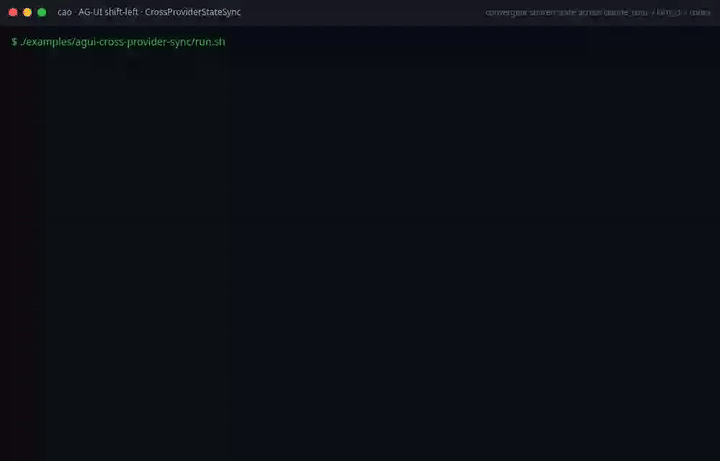

# AG-UI Cross-Provider State Sync Example

Demonstrates the `CrossProviderStateSync` L2 construct from the AG-UI
construct library.

## What it shows

- Folding `STATE_SNAPSHOT` into a local shared state
- Applying `STATE_DELTA` (RFC-6902 patches) to evolve the state
- `providers_seen()`: extracting unique providers from terminal entries
- `converges_with(authoritative)`: deep-equality convergence check
- Seen-Set deduplication for id-bearing frames
- `projection()` accessor returning the shared state

## Running

```sh
./examples/ag-ui/ag-ui-cross-provider-sync/run.sh
```

No live server or credentials are required. The example feeds synthetic AG-UI
frames directly into the construct, proving convergence logic in isolation.

## Demo recording (shift-left)



This GIF is **generated by the build**, not hand-made: the recorder in
[`../ag-ui-construct-demos/tools/`](../ag-ui-construct-demos/tools/) runs the
`run.sh` above and only exports the GIF if the example exits `0` and prints its
`PASS` marker. If the construct regresses, the recording fails and CI goes red
(the `AG-UI construct demos (shift-left recordings)` job) — the recording is the
test. Regenerate with `ONLY=agui-cross-provider-sync npm run record`.

## Composition pattern

```python
from cli_agent_orchestrator.services.agui import (
    AguiStreamReader,
    RecordingUiEmitter,
    CrossProviderStateSync,
)

reader = AguiStreamReader("http://localhost:9889")
emitter = RecordingUiEmitter()
sync = CrossProviderStateSync(emitter)

for event_id, agui_type, data in reader.frames():
    sync.handle_frame(agui_type, data, event_id)

if sync.converges_with(server_authoritative_snapshot):
    print("Client state has converged with the server")
```
