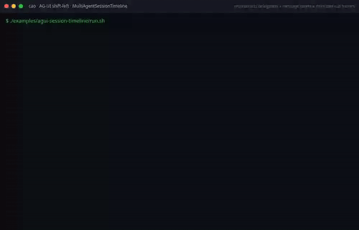

# AG-UI Session Timeline Example

Demonstrates the `MultiAgentSessionTimeline` L2 construct from the AG-UI
construct library.

## What it shows

- Opening delegation entries via `TOOL_CALL_START` frames
- Tracking message deliveries via `TEXT_MESSAGE_CONTENT` (metadata only)
- Closing delegations with `TOOL_CALL_END` / `TOOL_CALL_RESULT`
- Timeline ordering by `(started_at, id)`
- Seen-Set deduplication (replayed frames are no-ops)
- The `projection()` accessor for JSON-serializable output

## Running

```sh
./examples/ag-ui/ag-ui-session-timeline/run.sh
```

No live server or credentials are required. The example feeds synthetic AG-UI
frames directly into the construct, proving the fold logic in isolation.

## Demo recording (shift-left)



This GIF is **generated by the build**, not hand-made: the recorder in
[`../ag-ui-construct-demos/tools/`](../ag-ui-construct-demos/tools/) runs the
`run.sh` above and only exports the GIF if the example exits `0` and prints its
`PASS` marker. If the construct regresses, the recording fails and CI goes red
(the `AG-UI construct demos (shift-left recordings)` job) — the recording is the
test. Regenerate with `ONLY=agui-session-timeline npm run record`.

## Composition pattern

```python
from cli_agent_orchestrator.services.agui import (
    AguiStreamReader,
    RecordingUiEmitter,
    MultiAgentSessionTimeline,
)

reader = AguiStreamReader("http://localhost:9889")
emitter = RecordingUiEmitter()
timeline = MultiAgentSessionTimeline(emitter)

for event_id, agui_type, data in reader.frames():
    timeline.handle_frame(agui_type, data, event_id)

for entry in timeline.entries():
    print(f"{entry.kind}: {entry.sender} -> {entry.receiver} [{entry.status}]")
```
