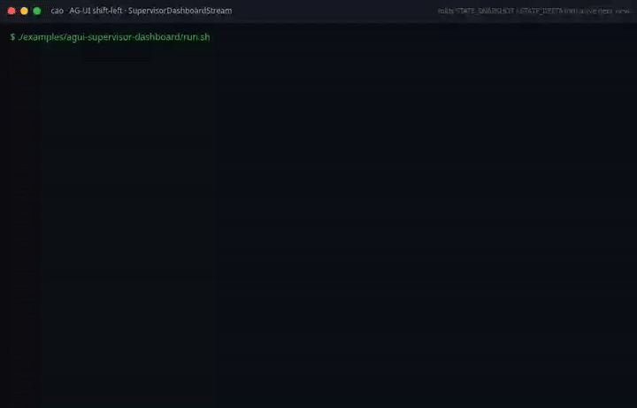

# AG-UI Supervisor Dashboard Example

Demonstrates the `SupervisorDashboardStream` L2 construct from the AG-UI
construct library.

## What it shows

- Folding `STATE_SNAPSHOT` and `STATE_DELTA` frames into a local fleet view
- Deriving `hierarchy()` (session-to-terminal grouping)
- Deriving `supervisor_snapshot()` (active counts, provider distribution, waiting terminals)
- Rollup counters from lifecycle frames (STEP_STARTED, TOOL_CALL_START, etc.)
- Seen-Set deduplication (replayed frames are no-ops)

## Running

```sh
./examples/ag-ui/ag-ui-supervisor-dashboard/run.sh
```

No live server or credentials are required. The example feeds synthetic AG-UI
frames directly into the construct, proving the fold logic in isolation.

## Demo recording (shift-left)



This GIF is **generated by the build**, not hand-made: the recorder in
[`../ag-ui-construct-demos/tools/`](../ag-ui-construct-demos/tools/) runs the
`run.sh` above and only exports the GIF if the example exits `0` and prints its
`PASS` marker. If the construct regresses, the recording fails and CI goes red
(the `AG-UI construct demos (shift-left recordings)` job) — the recording is the
test. Regenerate with `ONLY=agui-supervisor-dashboard npm run record`.

## Composition pattern

```python
from cli_agent_orchestrator.services.agui import (
    AguiStreamReader,
    RecordingUiEmitter,
    SupervisorDashboardStream,
)

reader = AguiStreamReader("http://localhost:9889")
emitter = RecordingUiEmitter()
dashboard = SupervisorDashboardStream(emitter)

for event_id, agui_type, data in reader.frames():
    dashboard.handle_frame(agui_type, data, event_id)

print(dashboard.supervisor_snapshot())
```
