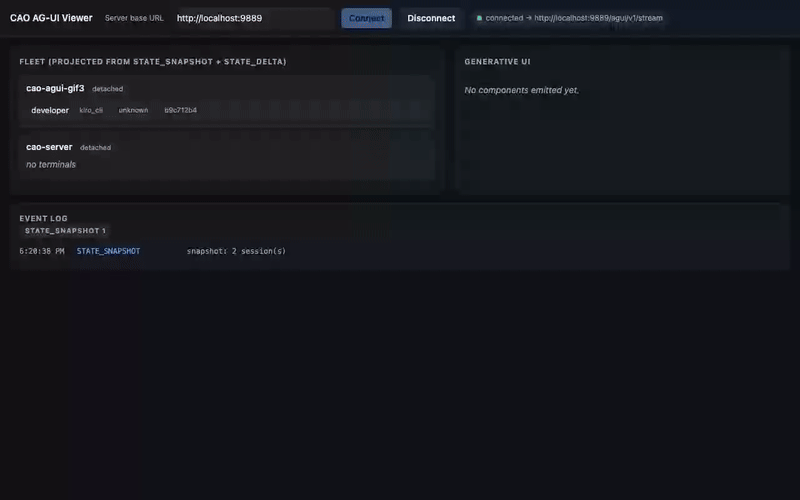

# AG-UI EventSource viewer (dependency-free)

A **single HTML file, zero dependencies** (no npm, no framework, no build step)
that consumes CAO's AG-UI SSE stream and renders the live fleet plus the six
allow-listed generative-UI components. This is the "a stock browser client
renders CAO's stream with zero custom code" demonstration — open it in any
modern browser and point it at a running `cao-server`.

It is the dependency-free counterpart to the standalone PWA that was removed
from PR #436; use this when you want to *see* the AG-UI stream with nothing to
install.

## What it does

- Opens `new EventSource('<base>/agui/v1/stream')` (base URL is editable in the
  header; default `http://localhost:9889`). An optional **Access token** field
  attaches `?access_token=` for auth-enabled servers (held in memory only).
- Listens for the named AG-UI events: `STATE_SNAPSHOT`, `STATE_DELTA`,
  `GENERATIVE_UI`, `RUN_STARTED`, `RUN_FINISHED`, `STEP_STARTED`,
  `STEP_FINISHED`, `TOOL_CALL_START`, `TOOL_CALL_END`, `TEXT_MESSAGE_CONTENT`,
  `RUN_ERROR`.
- Holds a **fleet projection**: hydrates from `STATE_SNAPSHOT` (`data.snapshot`)
  then applies RFC-6902 patches from `STATE_DELTA` (`data.delta`) with a tiny
  inline JSON-Patch applier (`add` / `replace` / `remove`) — no npm dependency.
  The sessions/terminals panel is derived from that projected state.
- Renders `GENERATIVE_UI` components (`approval_card`, `choice_prompt`,
  `diff_summary`, `progress`, `metric`, `agent_card`) from JSON props **only**,
  using DOM APIs (`textContent` / `createElement`) — **no `innerHTML`, no
  `eval`, no `dangerouslySetInnerHTML`**. It keeps a client-side mirror of the
  server's frozen allow-list; an unknown/off-list component renders an **inert
  labeled placeholder** and is never executed.
- Shows a live scrolling event log and per-type counters.
- Dedupes by event id, so the reconnect replay overlap (native `Last-Event-ID`
  or explicit `?since=`) never double-renders.

## Run it

```sh
# Terminal 1 — cao-server with the AG-UI surface enabled and CORS allowing the
# origin you'll serve the page from.
CAO_AGUI_ENABLED=1 CAO_CORS_ORIGINS="http://localhost:8000" cao-server

# Terminal 2 — serve this repo over http (EventSource needs http(s), not file://)
python3 -m http.server 8000
#   then open: http://localhost:8000/examples/agui-eventsource-viewer/

# Terminal 3 — drive the six components (+ the off-list refusal) on the live stream
./examples/agui-dashboard/showcase.sh
```

You should see the six components appear in the **Generative UI** panel as
`showcase.sh` emits them, the fleet panel populate from the snapshot, and the
event log scroll. The off-list `iframe` intent is refused **server-side (HTTP
400)** by `showcase.sh` and never reaches the stream; if any unknown component
name ever did arrive, this client would still render it as an inert placeholder.

### CORS

`EventSource` is subject to the browser's same-origin policy. Because the page
is served from `http://localhost:8000` and the stream is on
`http://localhost:9889`, the server must allow that origin. Set
`CAO_CORS_ORIGINS` to the page origin (as above). If you serve the page from a
different host/port, list that origin instead. Same-origin setups (serving the
page from `cao-server` itself) need no CORS config.

### Auth-enabled servers

Native `EventSource` cannot set an `Authorization` header, so when CAO has auth
enabled the stream takes the token as a query parameter:
`<base>/agui/v1/stream?access_token=<JWT>` (a `cao:read` JWT). The viewer has a
first-class **Access token** field in the header — paste a token there and click
**Connect**; the viewer builds the stream URL with `?access_token=` for you. You
can also hand the viewer a token by URL (`…/index.html?access_token=<JWT>`): it
is copied into the in-memory field and scrubbed from the address bar. The token
is held **in memory only** — never written to `localStorage`/`sessionStorage`,
never logged, and redacted from the on-screen status. Prefer a **short-TTL**
token since it appears in the request URL; see the guidance in
[docs/agui.md](../../docs/agui.md). Leave the field blank for the default
no-auth local path.

## Demo (auto-generated, shift-left)



The GIF above is **generated by the build**, not hand-recorded. `tools/record-demo.mjs`
boots a `CAO_AGUI_ENABLED` cao-server + a static server, drives this viewer through
the six `emit_ui` components and the off-list refusal, and **asserts each one renders**
(and that the off-list `iframe` never becomes a live element). Those assertions are the
shift-left test — a non-zero exit fails CI if the stream→component contract drifts — and
the animated GIF (`docs/media/agui-eventsource-viewer-demo.gif`) is the byproduct, exported
via `ffmpeg`. It runs in CI as the **AG-UI demo (shift-left recording)** job and can be run
locally:

```sh
cd tools
npm install && npm run playwright:install
npm run record   # -> docs/media/agui-eventsource-viewer-demo.gif (+ .webm)
```

`tools/` is dev/CI tooling only — the shipped viewer (`index.html`) stays dependency-free.

## Why dependency-free

The AG-UI wire is a closed vocabulary of **named components + JSON props** — no
HTML, no script, no `eval`. That is exactly what makes a stock browser client
safe to point at an untrusted heterogeneous fleet, and why this viewer needs no
framework: it is just an `EventSource`, a small JSON-Patch function, and DOM
calls.
