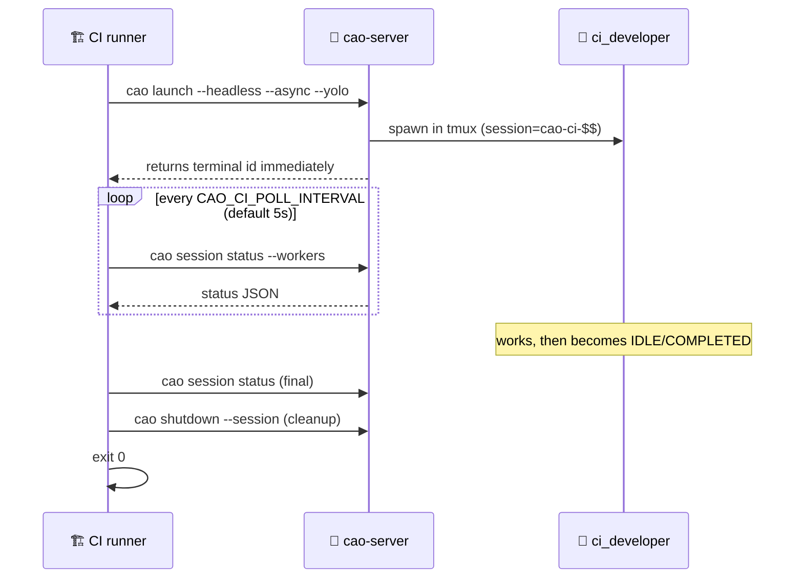

# Headless / CI Example

This example shows how to drive a single CAO agent from a CI runner — non-interactively, with a hard timeout, and with an exit code CI can act on. It uses the same `--headless --async --yolo` flag set documented in the [Session Management CLI](../../README.md#session-management-cli) section of the root README, wrapped in a polling loop.

## What this demonstrates

- Spawning an agent with `cao launch --headless --async`.
- Polling `cao session status --workers` until the agent reaches a terminal state.
- Mapping CAO terminal states to shell exit codes (`0` for success, `1` for error or unanswered prompt, `124` for timeout — matches GNU `timeout`).
- Cleaning up the tmux session on exit (success or failure).



## Files

- [`run.sh`](run.sh) — the runnable script. `set -euo pipefail`, hard timeout via `CAO_CI_TIMEOUT`, EXIT trap shuts down the session.
- [`ci_developer.md`](ci_developer.md) — minimal `role: developer` profile tuned for one-shot non-interactive execution. Always ends with a single-line summary, never asks follow-up questions.

## Setup

```bash
# 1. Start the CAO server (once)
cao-server

# 2. Install the profile
cao install examples/headless-ci/ci_developer.md
```

## Run

```bash
# Default prompt (prints the date)
./examples/headless-ci/run.sh

# Custom prompt
./examples/headless-ci/run.sh "Read pyproject.toml and report the package name."

# Tight timeout
CAO_CI_TIMEOUT=60 ./examples/headless-ci/run.sh "Quick task"
```

**Exit codes:**

| Code | Meaning |
|------|---------|
| `0` | Agent reached `IDLE` or `COMPLETED`. |
| `1` | Agent reached `ERROR`, or stalled at `WAITING_USER_ANSWER` (CI cannot answer). |
| `124` | Polling exceeded `CAO_CI_TIMEOUT` seconds (default 600). |

## Use in GitHub Actions

```yaml
- name: Spawn CAO agent
  env:
    CAO_CI_TIMEOUT: 300
  run: |
    cao-server &
    sleep 2
    cao install examples/headless-ci/ci_developer.md
    ./examples/headless-ci/run.sh "Audit dependencies for unused imports."
```

## See also

- [README -> Session Management CLI](../../README.md#session-management-cli) — headless launch flag reference.
- [`test/e2e/test_headless_ci.py`](../../test/e2e/test_headless_ci.py) — e2e test that invokes this script.
